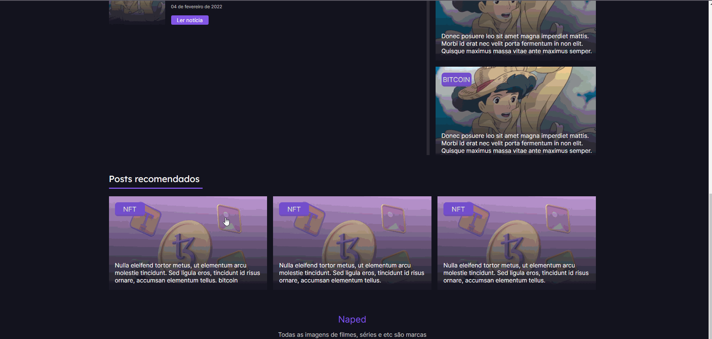
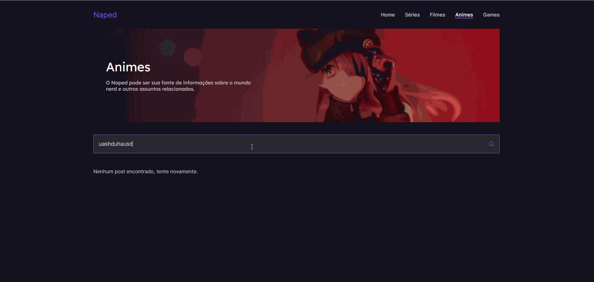

# Naped blog

  
  

## 💻 Sobre o projeto

---

<a href="#" target="_blank">Versão online</a>

É um desafio criado pela comunidade [Codelândia](https://discord.gg/wNCWTVuxyz). O layout original está no [Figma](https://www.figma.com/file/Yb9IBH56g7T1hdIyZ3BMNO/Desafios---Codel%C3%A2ndia?node-id=15409%3A2).

## 🚀 Tecnologias

---

Esse projeto foi desenvolvido com as seguintes tecnologias:

- NextJS
- Typescript
- Styled Components
- Prismic CMS
- Deploy realizado na Vercel

### Rodando localmente

---

1. Instalar todos os pacotes com `yarn install`
2. Executar o comando `yarn dev`
3. Em alguns seguntos a URL: `http://localhost:3000/` ficará disponível

## 🔖 Mais informações

---

Todas as etapas do desenvolvimento foram realizadas ao vivo na <a href="https://twitch.tv/devlucaslopes" target="_blank">Twitch</a>.

[Ver outros desafios](https://github.com/devlucaslopes/all-frontend-challenges)
